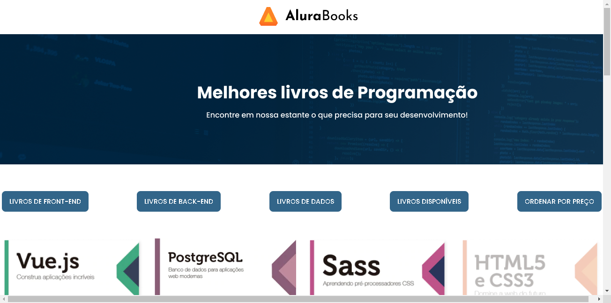

## Loja de Livros Online
Projeto de uma loja online construída com HTML, CSS e JavaScript que busca dados de livros de uma API externa, exibindo-os em uma grade. Permite filtrar por categoria e disponibilidade, além de ordenar por preço.

## Funcionalidades:
- Exibe livros em uma grade com: título, autor, preço, categoria, imagem e indicador de disponibilidade.
- Aplica 30% de desconto em todos os livros.
- Permite filtrar livros por categoria (Frontend, Backend, Dados, etc.) e disponibilidade (em estoque ou indisponível).
- Ordena os livros por preço (crescente).
- Calcula e exibe o valor total dos livros disponíveis.

## Tecnologias utilizadas:

